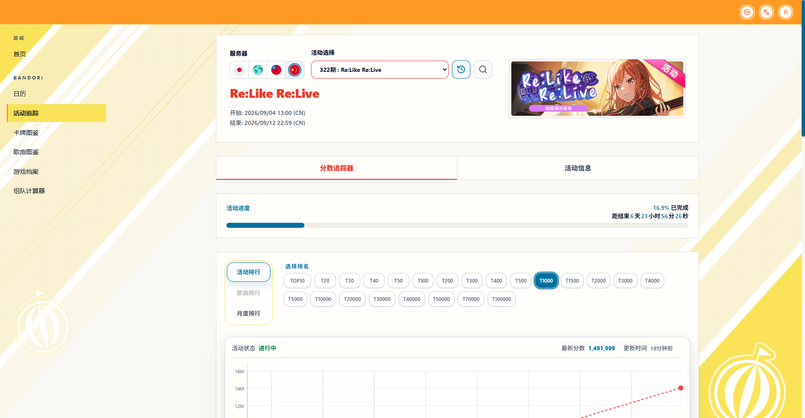

# Smile Patrol pre-release audit

Date: 2026-09-05. Base commit: `42e3650f`. Result: no blocking issues found in the scoped local working-tree audit. No commit, remote CI run or deployment was performed.

Final light-theme screenshot from the audited production build, captured at 1920 x 1000 in a signed-out Chromium session for the PR. The temporary local preview was stopped after capture.

## Accepted design and code boundaries

- Canvas: `#FAF8F4`, with continuous, unequal-width 132-degree yellow, pale-yellow and white ribbons. The upper-left bright yellow is restored and the lower-right yellow area enlarged. Fine strokes have softened edges and a mask that fades toward the center.
- Selected sidebar item: the same bright yellow as the canvas ribbon, with a 3 px orange indicator and bold text.
- Page panels and nested ranking-mode/chart containers share `--theme-color-panel-background: #FFFEFA`. Main panels are square with a `#DDDCD5` border and no shadow; nested containers retain their existing geometry. Plot backgrounds and individual controls keep their own color roles.
- Theme-specific palette/effects remain in the theme stylesheet; shared recipes provide semantic fallbacks. Components consume semantic tokens, and the frontend rules now document this separation of fill and geometry. No unresolved theme variable references were found.
- The white LOGO preserves the geometry and cutouts of `src/app/icon.png`. Stars remain undecided. Chart rendering/data, dark-mode values, event behavior and data sources were not changed.
- Reviewed all changed TSX, CSS and rule files. TSX edits only affect class names; no dependency or API changes are included.

## Verification

- `npm run build`: passed, including TypeScript validation and generation of 50 static pages. Compiled CSS contains the accepted panel color, panel class and LOGO URL.
- `npm run lint`: passed with 0 errors and 24 warnings, all in files outside this patch. Existing warnings were left outside this visual change.
- `node --import tsx --test tests/comment-ui-regressions.test.mjs tests/bandori-eventtracker-top10-ui.test.mjs tests/bandori-eventtracker-comment-links.test.mjs tests/bandori-events-consumers.test.mjs`: 21/21 passed.
- `node scripts/build-smile-patrol-logo.mjs`: passed its geometry/cutout checks and reproduced the PNG byte-for-byte. The dev asset URL returned HTTP 200, `image/png`, 65,014 bytes.
- Reused focused Chromium desktop/mobile evidence from this iteration: no horizontal overflow at 390 px, navigation drawer and tracker/info switching work, decorative layers do not intercept input, and toolbar controls retain their styles. Latest computed fills were `rgb(255, 254, 250)` for both nested containers and white for the plot; their existing corner radii were retained.
- Dark-mode checks from earlier in this change remain applicable: subsequent overrides are light-only, and the new nested semantic token defaults to the previous surface color in dark mode. Dynamic chart SVG element counts were not used as a pixel-equivalence claim.

## Release handoff

- Include both new files, `public/favicon/smile-patrol-logo-white.png` and `scripts/build-smile-patrol-logo.mjs`, with the eventual commit; the stylesheet depends on the PNG.
- Full unrelated CI/Rust suites, Safari/Firefox and authenticated write flows were not exercised. Required CI remains an integration gate.
- `git diff --check`: passed. The verified HHWX dev process tree was stopped; port 3000 has no listening process.

---

# Earlier Smile Patrol light-theme iterations

The following captures and results describe earlier iterations. The accepted palette and audit above supersede their old color and background descriptions.

## Scope and visual reference

- Date: 2026-09-05. Base commit: `42e3650f`; reviewed working-tree changes.
- Reference: `C:/Users/bluew/.codex/generated_images/01a070b0-9b13-7550-984e-65941d43a710/exec-d0d6ca69-262e-481a-8f53-bbd2277bf8ec.png` (1844 x 853 pixels).
- Preview: http://localhost:3000/bandori/events/322?type=event&tier=1000&server=cn&page=1
- Desktop capture: `C:/Users/bluew/.codex/visualizations/2026/09/05/01a070b0-9b13-7550-984e-65941d43a710/hhwx-desktop.png` (1842 x 854 CSS/image pixels, DPR 1).
- Mobile capture: same evidence directory, `hhwx-mobile.png` (390 x 844, DPR 1).
- Dark capture: same evidence directory, `hhwx-dark.png` (929 x 861, DPR 1).
- Browser: Chrome DevTools MCP. The in-app browser had repeatedly timed out during the preceding design iterations. Screenshot file export was denied by the tool's workspace mapping; its returned image bytes were saved unchanged through the local filesystem tools.
- State: Chinese, signed out, CN event 322, event ranking T1000. Live scores, timestamps and progress naturally differ from the generated mock.

## Visual comparison

The selected reference and final desktop capture were opened together for comparison. The negligible frame-size difference was recorded rather than resizing UI or changing the existing responsive layout. Existing layout, functional controls, chart internals and dark mode take precedence over incidental variations in the generated mock, as agreed with the user.

| Surface | Result |
| --- | --- |
| Typography and content | Existing fonts, sizes, labels, event banner and live data retained. Red title, blue functional accents and text hierarchy remain readable. |
| Layout and spacing | Main panel positions, dimensions and padding match the pre-change application. Outer panels are square, white and lightly bordered. |
| Colors and tokens | Broad warm-white center with continuous diagonal yellow/pale-yellow/white corner bands; pale-yellow navigation selection and orange indicator. Orange toolbar retained. |
| Assets | White site LOGO derived from `src/app/icon.png`, preserving the source geometry and negative space. The generated mock's inaccurate decorative mark is intentionally not reproduced. |
| Controls and layers | Existing toolbar button computed styles unchanged. Background decoration uses non-interactive body pseudo-elements without creating a new app stacking context. |

Initial review covered toolbar buttons, selected navigation, panel edges, the event banner frame and the derived LOGO on a yellow backing. It missed the diagonal hairlines and overly sparse background identified in the user's subsequent screenshot; those were corrected below. Individual comment cards and other pages' panels were not redesigned in this first rollout.

## Background refinement after user review

- The orange diagonal hairlines came from hard-stop, one-pixel gradient strokes. Removed these strokes and their orange token; continuous ribbons now have actual width and one-pixel color transitions at their edges.
- Expanded both corner compositions using unequal yellow, soft-yellow, pale-yellow and white bands. A very pale intermediate band connects each group to the warm-white center. Existing LOGO geometry, placement, controls and panel styling were retained.
- Updated captures in the evidence directory above: `hhwx-background-v2-desktop.png` (1920 x 911, DPR 1, matching the user's browser content area) and `hhwx-background-v2-mobile.png` (390 x 844, DPR 1). Visual inspection confirmed the circled orange hairlines were absent and the wider ribbons remained continuous.
- At 1842 x 854, light-mode chart styles/tokens, panel styles/rectangles, toolbar and navigation matched the state immediately before this refinement. Dark-mode styles also matched after responsive/color transitions settled; only the live comment section's height differed by 1.25 px.
- Mobile client width and scroll width both remained 390 px; decorative layers retained `pointer-events: none`. No browser console errors or warnings were observed.
- `npm run build` passed after the CSS refinement. Earlier lint/typecheck evidence remains applicable to the unchanged TypeScript files. No new application logic, dependency, chart styling or dark-mode rule was introduced.

## Iterations and verification

- The first mobile drawer check exposed the old saturated yellow backdrop. It was replaced with a white drawer and a neutral translucent backdrop; a subsequent 390 px screenshot verified the visible selection and overlay.
- The initial decorative layer used app isolation. It was moved to body pseudo-elements to preserve existing modal/header stacking; the final desktop comparison verified both LOGOs remained visible.
- Light-mode comparison: all 174 chart-subtree elements' captured style properties, chart color tokens, outer panel rectangles and toolbar controls matched the pre-change baseline.
- Dark-mode comparison: chart, outer-panel, toolbar, navigation and canvas styles matched the pre-change baseline. Decorative pseudo-elements are absent. A small comment-section height difference followed live content/image loading; the first four panel rectangles were identical.
- Mobile page width and scroll width both measured 390 px. Navigation opened and closed; switching to Activity Information updated the URL and rendered the overview/rewards/songs, then switching back restored the tracker.
- Long-page comment-area inspection verified the fixed background and non-obstructing decoration. Team-builder shell smoke check rendered meaningful content without horizontal overflow or console errors.
- No relevant browser console warnings/errors or framework error overlay were observed. The development toolbar is present in local screenshots.
- Passed: targeted ESLint for changed components and the logo script; `npm run typecheck`; final `npm run build`; `git diff --check`.
- `node scripts/build-smile-patrol-logo.mjs` generated the repository asset and verified both solid geometry and transparent cutouts. No runtime dependency was added.

## Remaining coverage

Chromium desktop/mobile emulation was exercised; Safari and Firefox were not. Authenticated comment submission and optimizer execution were outside this visual-only scope. Stars remain a separate future design decision. No production deployment was performed.

---

# Display Degree Design QA

## Comparison target

- Source visual truth:
  - `C:\Users\bluew\AppData\Local\Temp\codex-clipboard-19f6bc45-36e0-47b7-bfba-0930c9c7400e.png` (account-center identity card and requested insertion point)
  - `C:\Users\bluew\AppData\Local\Temp\codex-clipboard-da6c663a-5be7-4cc4-acce-a888f367b7d9.png` (team-builder profile-card visual language used only as the account-selector style reference)
  - `C:\Users\bluew\AppData\Local\Temp\codex-clipboard-3f6dff89-8fea-4965-9e71-36c902bf7dbc.png` (authoritative ranking-Degree layer geometry)
- Rendered implementation before the final size-only refinement:
  - `C:\Users\bluew\.codex\visualizations\2026\08\15\01a00701-7fad-7b83-aecc-de0004d42023\account-degree-saved-desktop.png`
  - `C:\Users\bluew\.codex\visualizations\2026\08\15\01a00701-7fad-7b83-aecc-de0004d42023\account-degree-mobile.png`
  - `C:\Users\bluew\.codex\visualizations\2026\08\15\01a00701-7fad-7b83-aecc-de0004d42023\account-degree-picker-desktop-post-fix.png`
  - `C:\Users\bluew\.codex\visualizations\2026\08\15\01a00701-7fad-7b83-aecc-de0004d42023\account-degree-picker-empty-account-mobile.png`
- Final focused ranking-Degree evidence:
  - `C:\Users\bluew\AppData\Local\Temp\hhwx-degree-ranking-same-origin.png`
  - `C:\Users\bluew\AppData\Local\Temp\hhwx-degree-ranking-comparison.png`
- Local implementation URL: `http://localhost:3001/account`
- Local asset source during browser QA: `http://localhost:4000` via a process-only `NEXT_PUBLIC_BANDORI_ASSET_CDN_BASE_URL` override, because the production CDN CORS policy permits `http://localhost:3000` but not the worktree's port 3001; no repository environment file was changed
- State: authenticated, verified local QA user; CN binding selected; `It's MyGO!!!!! TOP500` draft-selected only for the focused capture, then cancelled without saving

## Viewport and density normalization

| Artifact | Pixels | CSS viewport / crop | Density handling |
| --- | ---: | ---: | --- |
| Account source | 485 x 269 | Annotated crop, not a complete browser viewport | Compared as a focused identity-card region |
| Account desktop implementation | 1092 x 893 | 1100 x 900 viewport override | Browser capture at device scale 1; scrollbar/chrome account for the small pixel delta |
| Account mobile implementation | 477 x 747 | 485 x 760 viewport override | Browser capture at device scale 1; compared at the same nominal width as the account source |
| Picker style source | 996 x 300 | Related team-builder surface, not the final dialog state | Used for card geometry, border, spacing, server icon, and UID hierarchy only |
| Picker desktop implementation | 1100 x 900 | 1100 x 900 viewport override | Browser capture at device scale 1 |
| Picker mobile empty-state implementation | 477 x 747 | 485 x 760 viewport override | Browser capture at device scale 1 |
| Ranking layout source | 2532 x 1170 | 319 x 69 focused title region | Source render normalized from about 1.385x to the 115 x 25 CSS target |
| Ranking implementation | 190 x 95 | 115 x 25 Degree inside the focused capture | Chrome viewport 1920 x 911, device scale 1; compared at an equal 115 x 25 footprint |

The two sources describe different product states from the new selector, so a pixel overlay would create false precision. The source and implementation were opened together in the same comparison inputs, and the comparison was normalized around the focused card regions and the explicitly requested visual language.

## Full-view comparison evidence

- The account card preserves the existing HHWX blue identity surface, large radius, white primary type, subdued email, UID pill, avatar control, and verification badge.
- The Degree sits directly below the UID and to the right of the avatar, matching the annotated insertion point without disturbing the existing profile-entry cards. After the interaction pass, the shared display box was reduced from 230 x 50 to the final 115 x 25 at the user's request.
- The dialog keeps the account selector visually close to the team-builder cards: white surfaces, subtle border/shadow, server SVG, bold UID, and a sky selected outline. It deliberately omits profile name, card count, sync date, and cloud badge because the new control selects a bound account rather than a saved profile.
- At 485 px the identity card and Degree remain unclipped. The dialog becomes a one-column account and Degree list with a persistent footer and internal scrolling.

## Focused region comparison evidence

- Account identity region: compared the 485 px source crop against `account-degree-mobile.png`. Avatar, name/email/UID hierarchy, blue radius, and the requested below-UID Degree placement remained legible and balanced before the final size-only refinement.
- Account-selector region: compared the team-builder source against `account-degree-picker-desktop-post-fix.png`. Card height, radius, border weight, server icon scale, UID emphasis, two-column desktop grid, and selected outline carry over; the simplified content is intentional.
- Ranking-Degree region: matched the exact `It's MyGO!!!!! TOP500` base, rank, and crown resources from the implementation against the same title in the ranking-layout source. The source crown and 230 x 50 body share the same top-left origin; a zero-pixel native offset was the best pixel match. The final browser capture was normalized beside the source in `hhwx-degree-ranking-comparison.png`.
- Asset fidelity: the account cards use the existing `BandoriServerIcon` SVG assets. Every title uses the real Bandori Degree base/rank/icon resources or animation atlas; there are no hand-drawn or placeholder replacements.

## Required fidelity surfaces

- Fonts and typography: existing HHWX font stack and account hierarchy are unchanged. Dialog title, section labels, UIDs, helper copy, and button text use the established weights and line heights; no clipping or awkward wrapping was observed at either viewport.
- Spacing and layout rhythm: every Degree keeps the final 115 x 25 footprint. Ranking base and rank layers fill that box; the 25 x 25 crown layer starts at the same `left: 0; top: 0` coordinate and is painted above them. Its own transparent and grey connector pixels create the intended protruding-crown silhouette without expanding or offsetting the layout box. Desktop uses two account columns and up to three Degree columns; mobile collapses cleanly to one column. Radii, gaps, borders, and footer spacing match nearby account UI.
- Colors and tokens: existing blue identity-card color is preserved. White/light-slate selector surfaces and sky selected states match the supplied profile-card reference and maintain clear disabled/empty contrast.
- Image quality and asset fidelity: static PNG descriptors remain sharp and contained at native aspect ratio. Dynamic atlases render through the existing canvas implementation and hold the first frame when inactive or reduced motion applies.
- Copy and content: account grouping and selector copy are concise. Empty accounts and the empty list use the approved exact text `暂无可用称号`. JP Degree 100 is not exposed as a synthetic option and there is no reset control.

## Interaction and accessibility evidence

- Flow tested: `/account` -> click current Degree -> inspect grouped bound accounts -> select a different dynamic Degree -> save -> dialog closes -> account card updates.
- Save is disabled while the draft is unchanged and enabled after selection.
- Cancel discards the draft and preserves the saved Degree.
- The empty binding remains visible, is greyed, and displays `暂无可用称号`.
- The selected dynamic Degree changes rendered frames while active; inactive animations hold the first frame. Offscreen, page-visibility, and reduced-motion behavior remains delegated to `BandoriAtlasAnimationCanvas`.
- Post-fix dialog behavior: Escape closes the dialog, Shift+Tab wraps from the close button to the final enabled control, outside content is inert while open, and focus returns to the trigger.
- Page identity was `账号中心 - HHWX`; the page was non-blank; no Next.js error overlay appeared; Browser console error/warn log was empty after the final interaction pass.

## Comparison history

### Pass 1

- [P2] The custom portal dialog matched the visual reference but did not provide a focus trap or Escape-to-close behavior.
  - Impact: keyboard users could move focus behind the modal and could not use the conventional Escape shortcut.
  - Fix: replaced the custom portal semantics with the repository's existing Radix Dialog primitive, kept the same visual composition, added an explicit close label, and added pressed-state semantics to account cards.

### Pass 2

- Post-fix evidence: `account-degree-picker-desktop-post-fix.png` shows the unchanged visual composition with the Radix dialog active.
- Browser DOM and interaction evidence confirmed that background controls were inert, Shift+Tab wrapped to Cancel, Escape closed the dialog, and the trigger returned to the closed state.
- No remaining actionable P0, P1, or P2 findings.

### Pass 3

- [P2] The first ranking-Degree fix treated the crown as an external badge and shifted the 230 x 50 body right by 25 native pixels, producing a 127.5 x 25 outer footprint at the account size.
  - Evidence: this disagreed with the supplied game screenshot, where the crown resource's grey connector occupies the body's left edge rather than extending the layout box.
  - Fix: measured the exact source assets and screenshot instead of retaining the half-overlap estimate.

### Pass 4

- Source matching located the crown resource at approximately `(593, 627)` and about `1.385x` scale. Compositing the 50 x 50 crown and 230 x 50 body at a zero-pixel native offset produced the best match; even a one-pixel body shift increased the pixel error.
- Browser geometry for the final implementation measured base and rank at `(1225.15625, 454.5)`, 115 x 25, and the crown at the same `(1225.15625, 454.5)` origin, 25 x 25.
- `hhwx-degree-ranking-comparison.png` contains the equal-size source and final implementation crops. No actionable P0, P1, or P2 geometry mismatch remains.

## Findings

- No actionable P0, P1, or P2 visual, responsive, interaction, accessibility, asset, or copy differences remain.
- The final requested size is enforced as one 115 x 25 box by the shared `BandoriDegreeView` and the account-card fallback. Ranking base, rank, and crown layers share the same origin; the crown remains square at 25 x 25 and overlays the body's left edge. A focused source regression test rejects the earlier 230 x 50 classes, the incorrect shared aspect-ratio box, and any ranking-only width expansion. The underlying static and animated resources retain their original resolution.

## Primary interactions tested

1. Authenticated account card renders the stored default JP Degree 100.
2. Dialog loads every binding in stable UID order and initially selects the first account owning the saved Degree.
3. A valid static Degree and two dynamic Degrees render from the public Degree catalog.
4. Dynamic draft selection enables Save; save persists and updates the account card.
5. Cancel discards a later draft.
6. Empty account grouping, mobile layout, internal dialog scrolling, fixed footer, Escape, and keyboard focus wrapping work.

## Comment Display Degree QA

### Comparison target

- Source visual truth: `C:\Users\bluew\AppData\Local\Temp\codex-clipboard-445f5270-596f-47c4-9f79-892de6efe589.png` (the requested second line below the author metadata)
- Desktop implementation: `C:\Users\bluew\.codex\visualizations\2026\08\15\01a00701-7fad-7b83-aecc-de0004d42023\comment-degree-preview-desktop-3px.png`
- Narrow implementation: `C:\Users\bluew\.codex\visualizations\2026\08\15\01a00701-7fad-7b83-aecc-de0004d42023\comment-degree-preview-mobile-3px.png`
- Local implementation URL: `http://localhost:3001/bandori/cards/595?server=cn&page=1`
- State: authenticated local QA user; one public card comment; dynamic CN Degree 20099 selected

| Artifact | Pixels | Viewport / crop | Comparison use |
| --- | ---: | ---: | --- |
| Comment source | 258 x 75 | Focused annotated crop | Author avatar, first-line metadata, and requested second-line placement |
| Desktop implementation | 1092 x 893 | Default in-app browser viewport | Full page and comment-card relationship |
| Narrow implementation | 477 x 747 | 485 x 760 viewport override | Wrapping, clipping, and horizontal-overflow check |

The source and final desktop capture were opened together in the same comparison input. The source is an annotated crop rather than a complete screen, so fidelity was evaluated around the author header rather than by pixel overlay.

### Layout and asset evidence

- The author area now has two explicit rows to the right of the avatar: nickname and timestamp on the first row, the Degree on the second.
- The comment variant is one 92 x 20 box for both ordinary and ranking Degrees. Ranking icons remain 20 x 20 and share the body's top-left origin, so they do not increase the footprint. Its two 20 px rows plus the final 3 px inter-row gap fit inside the existing 44 px avatar/header minimum, so a normal one-line author header does not gain vertical height from the Degree. The 43 px group remains vertically centered by the header's flex alignment.
- The account-center variant remains 115 x 25; the compact size is scoped to comments and does not silently change the selector or account card.
- The captured dynamic Degree rendered through the existing canvas path at 92 x 20 with the correct accessible name. Static Degrees use the same catalog mapping and image path.
- The comment thread loads one shared Degree catalog and resolves all author selections from that map. Each comment does not create an independent catalog request.
- At 485 px the Degree, metadata, content, and actions remain inside the comment card without horizontal overflow or clipping.

### Behavior and regression evidence

- The comment API returns the author's current `display_degree_server` and `display_degree_id`; existing comments therefore follow the latest account-center selection instead of storing a publish-time snapshot.
- Refreshing the comment list preserved the comment and Degree.
- Dynamic rendering retains the existing offscreen, page-visibility, and reduced-motion controls. The QA browser exposed the resource through the canvas path; a static capture is expected when reduced motion or an unchanged animation frame applies.
- Page identity was `山吹 沙绫 - 点缀 卡牌图鉴 - HHWX`; the page was non-blank; no Next.js error overlay appeared; the final browser console error/warn log was empty.
- Focused comment contract, UI regression, account Degree, Degree catalog, Supabase, type-check, lint, and production-build validation passed. Lint retained 30 pre-existing warnings and introduced no errors.

### Comment findings

- No actionable P0, P1, or P2 visual, responsive, data-contract, accessibility, or asset-fidelity differences remain.
- The single 92 x 20 footprint is legible at both tested widths and satisfies the requirement not to add height to the common one-line comment header. Further reduction is not needed for this layout.

final result: passed

---

# Chart Simulator Controls Design QA

## Comparison target

- Game control references:
  - `C:/Users/bluew/AppData/Local/Temp/codex-clipboard-39a38488-2222-4cdf-aba8-908999e983fa.png`
  - `C:/Users/bluew/AppData/Local/Temp/codex-clipboard-9fa3c9e0-70db-4832-9ec8-b0922ce8b490.png`
- Existing HHWX product references:
  - `C:/Users/bluew/.codex/visualizations/2026/08/23/01a02dda-1b7c-74e2-a50f-33d9b06df9f4/song-simulator-audit/05-cards-controls-reference.png`
  - `C:/Users/bluew/.codex/visualizations/2026/08/23/01a02dda-1b7c-74e2-a50f-33d9b06df9f4/song-simulator-audit/06-events-tabs-reference.png`
- Final full-page implementation:
  - `C:/Users/bluew/.codex/visualizations/2026/08/23/01a02dda-1b7c-74e2-a50f-33d9b06df9f4/song-simulator-implementation/09-full-page-final.png`
- Combined focused control comparison:
  - `C:/Users/bluew/.codex/visualizations/2026/08/23/01a02dda-1b7c-74e2-a50f-33d9b06df9f4/song-simulator-implementation/06-focused-comparison.png`
- Combined HHWX system comparison:
  - `C:/Users/bluew/.codex/visualizations/2026/08/23/01a02dda-1b7c-74e2-a50f-33d9b06df9f4/song-simulator-implementation/10-system-comparison.png`
- Mobile implementation after the responsive correction:
  - `C:/Users/bluew/.codex/visualizations/2026/08/23/01a02dda-1b7c-74e2-a50f-33d9b06df9f4/song-simulator-implementation/08-mobile-loop-effects-final.png`
- Local route: `http://localhost:3000/bandori/songs/359?difficulty=special&view=simulator`
- State: Chinese locale, light theme, song 359 SPECIAL, simulator resources ready, playback paused, full-song loop range, ordinary skin settings selected

## Viewport and state

- Desktop captures use the in-app browser's default 1272 x 718 viewport; the final full-page capture is 1272 x 3187.
- The responsive pass uses a temporary 390 x 844 viewport override and restores the default browser viewport after capture.
- Reference screenshots describe the game control hierarchy and existing HHWX visual system rather than a pixel-identical complete simulator page. Fidelity is judged at the relevant controls and product-system surfaces.

## Full-view comparison evidence

- The simulator preserves the existing white rounded HHWX surfaces, subtle borders and shadows, orange primary action, deep-teal secondary controls, and red first-level tab emphasis.
- The effect and skin groups remain in their approved order and stay expanded at the bottom of the page.
- The skin choice grid uses the same compact rounded-choice language as Cards filters, including a deep-teal selected state and neutral unselected state.
- The song-detail top tab continues the established Events-style first-level tab treatment instead of introducing a simulator-only navigation pattern.

## Focused control comparison evidence

- Note speed uses the requested seven-part `double chevron / chevron / minus / value / plus / chevron / double chevron` hierarchy. Playback speed uses the approved five-part subset.
- Visible controls contain icons only; step magnitudes are exposed through accessible names and are not rendered as `+0.50`-style labels.
- The controls retain the game reference's square rounded button rhythm while applying HHWX's deep-teal action tokens instead of copying the source's pink.
- Switches use real `role="switch"` semantics, visible on/off text, a neutral off state, and a deep-teal active state.
- Playback time renders to three decimal places, and the loop timeline uses fixed deep-teal boundary indicators plus a translucent selected span.

## Interaction and accessibility evidence

- Note-speed `+0.01` changed `10.00` to `10.01`, and the inverse control restored the original value.
- Automatic loop and simultaneous-line switches updated both `aria-checked` and their visible state labels, then restored their original settings.
- Applying `10.000-20.000` updated the loop range and timeline positions. Reset immediately restored `0.000-108.480` without changing the loop mode or switch state.
- Playback advanced to `0:01.251 / 1:48.480`, the pause action returned the control to Play, and the millisecond display remained stable.
- Browser logs contained no runtime errors, missing-message failures, or Next.js error overlay in the final state.

## Comparison history

### Pass 1

- [P2] The seven-part note-speed control overflowed the effect card at 390 px and exposed a horizontal scrollbar.
- Fix: reduced only the narrow-viewport button width, value width, and gap while retaining 40 px control height and the full desktop sizing.

### Pass 2

- The 390 x 844 recapture shows the complete seven-part control on one line without clipping or horizontal scrolling.
- No remaining actionable P0, P1, or P2 visual, responsive, interaction, accessibility, copy, or system-alignment findings were observed.

final result: passed

---

# Simulator Skin Controls Design QA

## Evidence

- Source visual truth: `C:/Users/bluew/AppData/Local/Temp/codex-clipboard-4f4896d5-8f18-4620-9d52-5971854c9ecd.png`
- Browser-rendered implementation: `C:/Users/bluew/.codex/visualizations/2026/08/16/01a00c88-d223-7962-a332-c648184cf7e0/simulator-skin-controls-viewport.png`
- Focused implementation crop: `C:/Users/bluew/.codex/visualizations/2026/08/16/01a00c88-d223-7962-a332-c648184cf7e0/simulator-skin-controls-implementation-crop.png`
- Combined comparison: `C:/Users/bluew/.codex/visualizations/2026/08/16/01a00c88-d223-7962-a332-c648184cf7e0/simulator-skin-controls-comparison.png`
- Local route: `http://localhost:3000/bandori/songs/1`
- Requested CSS viewport: `1568×827`, device pixel ratio `1`
- Source bitmap: `1600×827`; implementation viewport bitmap: `1560×823`
- Focused source crop: `1460×310`; focused implementation crop: `1142×363`
- Density normalization: none. Both crops were compared at their captured one-pixel density; the narrower implementation width is the existing HHWX content-container constraint, not an image scaling artifact.
- State: Chinese locale, light theme, simulator stage ready, default field/note/directional skins selected, page scrolled to the style controls.

## Comparison Scope

The reference supplies an organization target rather than a full HHWX page target. Full-page composition, background, navigation, palette, and typography remain governed by the existing HHWX design system. The valid full-view comparison is therefore the four-row selector region: note style, directional Flick style, paired field/judgment-line style, and background.

The focused combined comparison confirms the same left-label/right-choice hierarchy, the same row order, wrapping for the long field-skin list, visible selected states, and a single `skin00` background choice. A separate finer crop is unnecessary because all labels and button states are legible in the focused comparison.

## Required Fidelity Surfaces

- Fonts and typography: the implementation keeps HHWX's established font, weight, and text hierarchy. It does not copy Bestdori typography; this is intentional because only the organization was requested.
- Spacing and layout rhythm: four aligned rows, a stable label column, wrapping choice groups, and consistent row gaps are present. The implementation is narrower because it remains inside the existing song-detail content container.
- Colors and visual tokens: existing HHWX surface, border, focus, and pressed-state tokens are retained. Bestdori's blue selection treatment is not imported as a new visual parameter.
- Image quality and asset fidelity: these controls contain no imagery or non-standard icons, so no asset substitution is involved.
- Copy and content: TYPE1–TYPE7, TYPE1–TYPE5, all 15 master-ordered field labels, and the sole `skin00` background choice are present. The paired field/judgment-line label makes the runtime coupling explicit.

## Findings

No actionable P0, P1, or P2 differences were found for the approved organization-only target.

Intentional differences:

- HHWX theme tokens, rounded controls, content width, and typography remain unchanged.
- The background row contains only `skin00`, as explicitly requested.
- Controls outside the four approved style selectors are not cloned from the reference.

## Comparison History

- Pass 1: no P0/P1/P2 finding; no visual fix was required.

## Static Verification

- The four groups and all expected labels were present in the rendered DOM.
- The default selections were visible as pressed states.
- The browser console contained no errors or warnings in the captured state.
- Interaction testing was intentionally omitted at the user's request; the implementation is covered by source contracts and focused tests instead.

## Implementation Checklist

- [x] Keep the four selector rows in reference order.
- [x] Preserve the existing HHWX visual system.
- [x] Keep background limited to one selected `skin00` button.
- [x] Keep unverified simulator capabilities disabled.

final result: passed
